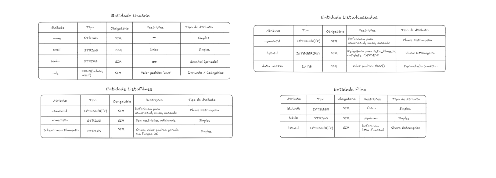
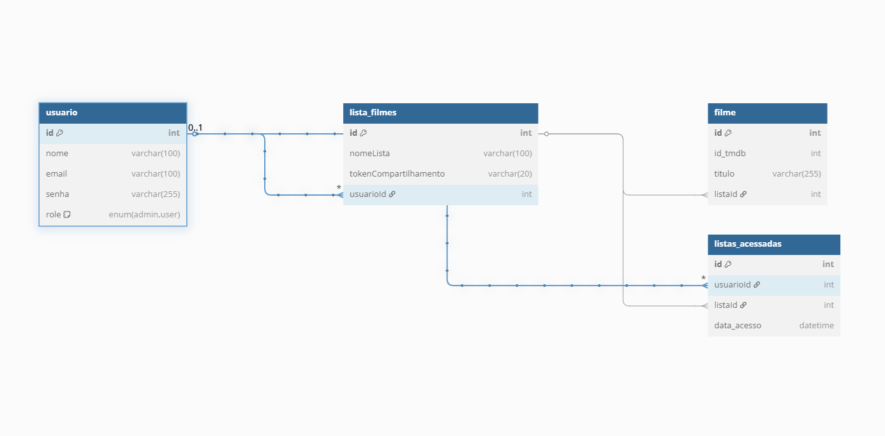

# Rebobina - Backend (Documentação)

## Pré-requisitos
- Node.js 23.11.0
- MySQL
- Postman ou Insomnia (para testar rotas)

## Conteúdo
1. Descrição do Projeto
2. Estrutura Básica
    - Requisitos Funcionais
    - Requisitos Não Funcionais
    - Diagrama de Relação de Entidade (ER) e restrições 
    - Esquema do Banco de Dados
3. Implementação das Funcionalidades
    - Criação de Usuário
    - Login com JWT
    - Criação de Lista Automática
    - Compartilhamento de Lista
    - Aleatorização de Filmes
4. Rotas da API

## 1. Descrição do Projeto
O backend do Rebobina fornece todas as funcionalidades essenciais para que usuários criem e compartilhem listas de filmes, mantendo autenticação segura, controle de acesso e persistência de dados. Ele se comunica com o frontend por meio de uma API RESTful.

## 2. Estrutura Básica

### 2.1 Requisitos Funcionais
- O usuário pode se registrar com nome, e-mail, senha.
- O usuário pode realizar login e logout com autenticação via JWT.
- Após login, o usuário pode adicionar, editar e deletar filmes em sua lista.
- O sistema cria automaticamente uma lista padrão no primeiro login do usuário.
- Um usuário pode compartilhar sua lista com outros usuários.
- O sistema permite aleatorizar um filme a partir de uma lista com no mínimo 3 títulos.
- As rotas privadas exigem autenticação via JWT.
- A api deve garantir consistência dos dados entre tabelas (relacionamento entre usuários, listas e filmes).
- Outros usuários convidados podem adicionar filmes á lista compartilhada.
- O usuário pode deletar uma lista (se for o criador original).

### 2.2 Requisitos não Funcionais
- Senhas devem ser armazenadas de forma segura.
- Somente usuários autenticados podem acessar rotas protegidas da API.
- Um usuário não pode visualizar ou editar listas privadas de outros usuários sem permissão.
- O sistema deve responder ás requisições em até 3 segundos na média.
- Dados devem ser persistidos mesmo após falhas ou quedas do servidor.

### 2.3 Entidades e seus atributos

Abaixo estão representadas as principais entidades que compõem o sistema Rebobina, bem como seus respectivos atributos. As entidades foram identificadas com base nas funcionalidades essenciais do sistema, como gerenciamento de usuários, listas de filmes, adição de sugestões e histórico de acesso.
Cada entidade é acompanhada de seus atributos classificados como simples, derivados ou chaves (primárias e estrangeiras), além do tipo da entidade (forte ou fraca, quando aplicável).

### 2.4 Esquema de banco de dados relacional

A imagem abaixo representa o esquema relacional do banco de dados do Rebobina. Ela mostra de forma detalhada as tabelas que compõem o sistema, seus atributos, tipos de dados e as relações entre elas por meio de chaves primárias (PK) e estrangeiras (FK).
Esse esquema é fundamental para garantir a consistência, integridade e eficiência da aplicação, permitindo que os dados dos usuários, listas e filmes sejam armazenados e recuperados de maneira estruturada.

3. Implementação das Funcionalidades

### 3.1 Criação de Lista Automática no Login

Rebobina é centrado na experiência do usuário desde o primeiro acesso. Por isso, ao realizar o primeiro login, o sistema verifica se o usuário já possui uma lista associada. Se não houver, uma lista padrão é criada automaticamente com base no ID do usuário. Isso garante que qualquer pessoa que se autentique já tenha uma base para começar a adicionar filmes, simplicando o processo.

### 3.2 Compartilhamento de Lista com Token

Cada lista criada recebe um tokenCompartilhamento exclusivo, gerado automaticamente por uma função na aplicação. Esse token pode ser compartilhado com amigos ou parceiros para que possam acessar ou contruibuir com a mesma lista de filmes.
O sistema deve manter:
- Privacidade: somente usuários com o token e autenticação podem participar.
- Persistência de vínculo: acessa são registrados com timestamp.
- Colaboração: todos os participantes podem adicionar ou visualizar sugestões.

### 3.2 Aleatorização de Filmes na Lista

A função de sorteio de filmes é a solução prática para o problema da indecisão, alvo central do Rebobina. Essa escolha aleatória reduz tempo e frustração do usuário, reforçando a proposta de “filtragem divertida e descomplicada”