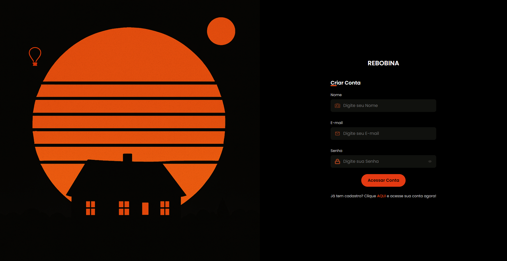
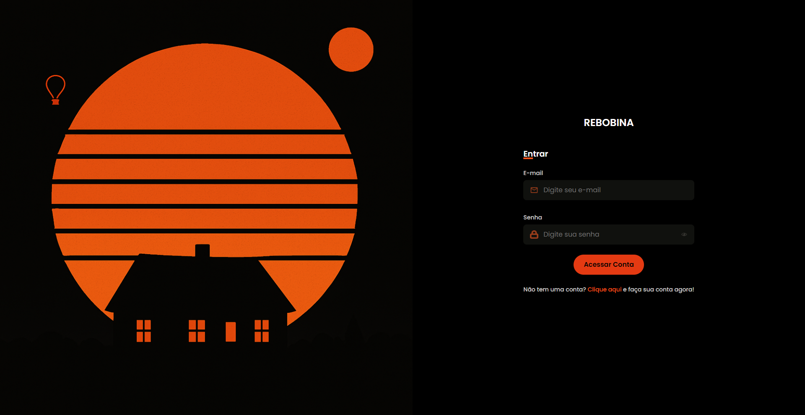
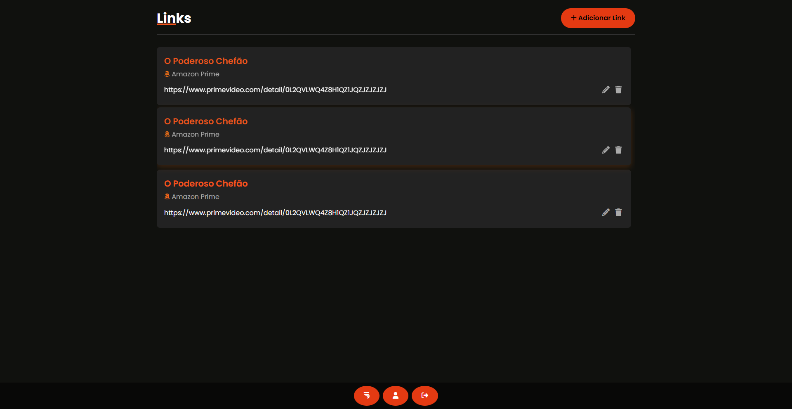

# Rebobina - Frontend (Documentação)
Interface web desenvolvida em HTML, CSS e JavaScript puro, responsável por conectar os usuários ao backend do Rebobina e entregar uma experiência colaborativa, leve e funcional.

## Sobre o projeto
Este frontend oferece uma interface intuitiva e responsiva para que os usuários possam:
- Cadastrar ou acessar sua conta
- Criar ou acessar uma lista de filmes
- Adicionar filmes a uma lista 
- Compartilhar listas com outros usuários
- Sortear aleatoriamente um filme para assistir
Mesmo sem frameworks como React ou Vue, o sistema busca entregar uma navegação fluida com manipulação dinâmica de DOM e integração com API REST por meio de fetch().

## Identidade visual
O Rebobina adota uma estética minimalista em tons de preto e laranja, remetendo ao mundo do cinema e ao ato de “rebobinar” ideias para resgatá-las em forma de escolhas conscientes.

## Em constante evolução
A interface está passando por refinamentos frequentes de usabilidade, acessibilidade e layout visual. Nosso objetivo é oferecer a melhor experiência possível, tanto em desktop quanto em dispositivos móveis.

## Imagens do Sistema
Abaixo estão imagens demonstrando o fluxo de uso do sistema

## Página de Cadastro

## Página de Login

## Página de Principal

